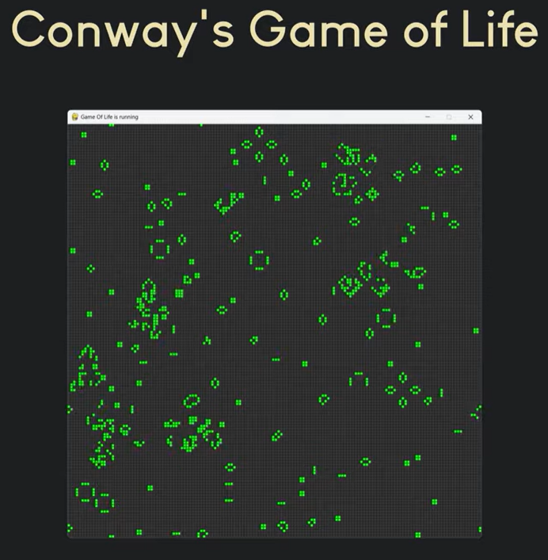

# python-game-of-life
A Pygame version of Conway's Game of Life simulation, made with the community branch of pygame, pygame-ce

# About
This game or simulation was made following the [Conway's Game of Life tutorial in Python & Pygame - OOP](https://youtu.be/uR0lNADr4dc?list=PL4NKE1UBtl_eUT7rpi8QPKluc0ihDDVNS) made by [Nick Koumaris](https://www.youtube.com/@programmingwithnick).

# Rules
There are 4 simple rules to the simulation that each cell follows, these are:
- **Underpopulation**: A live cell with fewer than two live neighbors dies.
- **Stasis**: A live cell with two or three live neighbors lives onto the next generation.
- **Overpopulation**: A live cell with more than three live neighbors dies.
- **Reproduction**: A dead cell with exactly three live neighbors becomes a live cell.